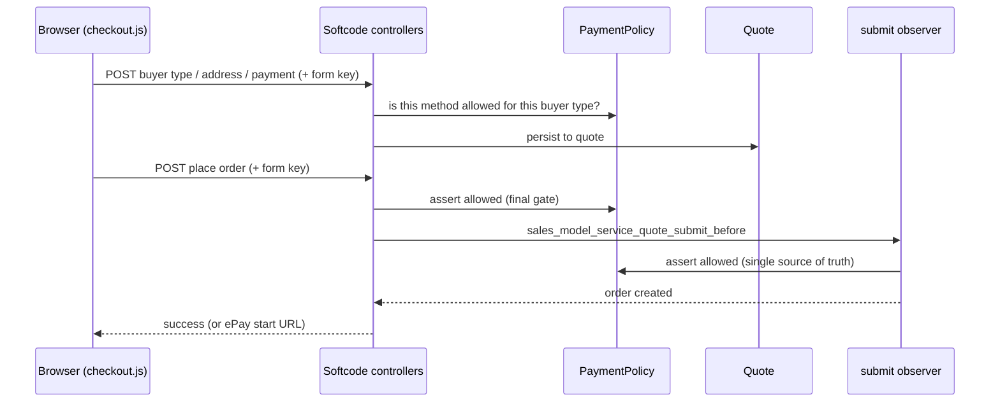

# Softcode_CheckoutOverride

A Magento 2 module that replaces the default checkout with a custom, server-driven
**one-page checkout**. It targets shops with buyer-type rules the native checkout
can't express — private, company (CVR) and public-sector (EAN) buyers — each with
its own allowed payment methods, and an optional **ePay (Bambora)** hosted payment
window.

The frontend is deliberately a small **reference implementation**: the value is in
the server-side architecture (a single payment policy, CSRF-validated endpoints,
clean dependency injection), which you build your own UI on top of.

---

## Requirements

- Magento **2.4.x**
- PHP **8.1** or **8.2**
- Optional: `epay/payment` for the ePay payment window

## Installation

```bash
composer require softcode/module-checkout-override
bin/magento setup:upgrade
bin/magento setup:di:compile
bin/magento cache:flush
```

Or copy the module to `app/code/Softcode/CheckoutOverride` and run the same commands.

---

## Business rules

Buyer type determines the allowed payment methods. These rules live in **one place**
— `Model\Payment\PaymentPolicy` — and are enforced by the controllers *and* the
order-submit observer, so there is never more than one source of truth.

| Buyer type | Allowed payment methods |
| --- | --- |
| `privat` (private) | ePay |
| `cvr` (company) | ePay, purchase order (invoice) |
| `ean` (public sector) | ePay, purchase order (invoice) |

The buyer's chosen method is **never silently overwritten** — it is only validated.
The ruleset is configurable in `etc/di.xml` without touching code.

> **Note:** all orders are placed as **guest** orders by design (quick B2C/B2B
> checkout without account creation). Change this in `PlaceOrder` if your shop
> requires customer accounts.

---

## How it works



Every POST carries Magento's **form key**, validated via `CsrfAwareActionInterface`.
Exceptions are logged server-side; the browser only ever sees a safe message.

### Endpoints

| Method | Route | Purpose |
| --- | --- | --- |
| `GET`  | `/softcode/cart/index` | Cart items and totals (from Magento's quote collectors) |
| `POST` | `/softcode/cart/applyCoupon` | Apply / clear a discount code |
| `POST` | `/softcode/index/index` | Save buyer type (privat / cvr / ean) |
| `GET`  | `/softcode/index/paymentMethods` | Available payment methods |
| `POST` | `/softcode/index/saveAddress` | Save billing + shipping address |
| `POST` | `/softcode/index/savePayment` | Save the chosen payment method (policy-checked) |
| `POST` | `/softcode/index/placeOrder` | Place the order |
| `GET`  | `/softcode/epay/config` | ePay payment-window parameters (if ePay installed) |

---

## Testing

```bash
vendor/bin/phpunit -c dev/tests/unit/phpunit.xml.dist \
  app/code/Softcode/CheckoutOverride/Test/Unit
```

`PaymentPolicyTest` is the executable specification of the payment rules
(privat / cvr / ean × ePay / purchase order / invalid).

## What CI checks

The GitHub Actions workflow runs on every push/PR and **fails the build** on:
- PHP syntax errors (`php -l`)
- Magento 2 coding-standard **errors** (`phpcs --standard=Magento2 -n`)

It does **not** run the unit or integration tests (those need a Magento install) —
run those locally as shown above.

## Known limitations

- The **frontend** template/JS is a minimal reference; smoke-test the checkout flow
  after install. It is not covered by browser tests.
- **Shipping method** selection is expected from your shipping module/theme; this
  module owns buyer type, address, payment and order placement.
- **ePay** is optional; without `epay/payment` the ePay endpoint returns
  "not available" and the rest of the checkout works normally.

## License

MIT — see [LICENSE](LICENSE).
